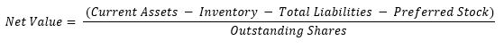

# Finance

## Strategies ##

### Warren Buffett's Approach to Investing: ###

> https://superiornorthllc.com/2019/09/08/warren-buffetts-cigar-butt-approach-to-investing/

### Gekko Trading Strategy: ###

> Trading Stategies: https://gekko.wizb.it/docs/strategies/creating_a_strategy.html

## Finance API's ##

 - Google API is depricated and not supported by google anymore.

- Basic Yahoo API works good, However the premium version can not be obtained in South Africa, might have to look at using a VPN.

- https://nomics.com/  

## Resources ##

> Telegram Bot Api: https://core.telegram.org/bots/api
(Note: The official Luno API Handler is written in GO!)

> WebCrawler: https://scrapy.org/ and https://flask.palletsprojects.com/en/1.1.x/

> This is a cool Python finance course -> https://www.youtube.com/watch?v=2BrpKpWwT2A&list=PLQVvvaa0QuDcOdF96TBtRtuQksErCEBYZ
